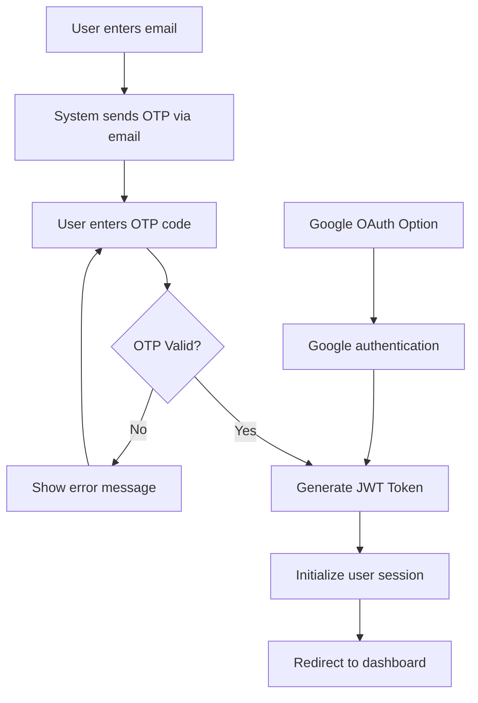

<p align="center">
  
</p>

<h1 align="center">🩺 MediConnect – Patient Healthcare App</h1>

<p align="center">
  <strong>A modern, scalable healthcare application for patients built with React Native</strong>
</p>

<p align="center">
  Book appointments • View prescriptions • Manage medical data — all in one place
</p>

<p align="center">
  
  
  
  
</p>

---

## 🧭 Table of Contents

- [✨ Features](#-features)
- [🛠️ Tech Stack](#️-tech-stack)
- [📂 Project Structure](#-project-structure)
- [🖼️ Screenshots](#️-screenshots)
- [🚀 Getting Started](#-getting-started)
  - [📋 Prerequisites](#-prerequisites)  
  - [📱 Frontend Setup](#-frontend-setup)
  - [🔧 Backend Setup](#-backend-setup)
- [🔐 Authentication Flow](#-authentication-flow)
- [🤝 Contributing](#-contributing)
- [📧 Contact](#-contact)
- [📄 License](#-license)

---

## ✨ Features

<table>
  <tr>
    <td>🔐</td>
    <td><strong>Secure Authentication</strong><br/>OTP-based login with JWT tokens and Google OAuth support</td>
  </tr>
  <tr>
    <td>🔍</td>
    <td><strong>Doctor Search</strong><br/>Find healthcare providers by specialty, location, and availability</td>
  </tr>
  <tr>
    <td>📅</td>
    <td><strong>Appointment Booking</strong><br/>Schedule and manage appointments with ease</td>
  </tr>
  <tr>
    <td>💊</td>
    <td><strong>Prescription Management</strong><br/>View and track your prescriptions digitally</td>
  </tr>
  <tr>
    <td>📋</td>
    <td><strong>Medical Records</strong><br/>Access your complete medical history and information</td>
  </tr>
  <tr>
    <td>👤</td>
    <td><strong>Profile Management</strong><br/>Update personal information and app preferences</td>
  </tr>
  <tr>
    <td>🏠</td>
    <td><strong>Dashboard</strong><br/>Clean, intuitive home screen with quick access to key features</td>
  </tr>
  <tr>
    <td>📱</td>
    <td><strong>Responsive Design</strong><br/>Optimized for mobile with component-based architecture</td>
  </tr>
</table>

---

## 🛠️ Tech Stack

### Frontend
- **React Native** - Cross-platform mobile development
- **React.js** - Web version (planned)
- **Native Components** - Custom styling and UI components

### Backend
- **Node.js** - Runtime environment
- **Express.js** - Web application framework
- **PostgreSQL** - Database (hosted on NEON)

### Authentication & Security
- **JWT** - JSON Web Tokens for secure authentication
- **Google OAuth** - Social login integration
- **OTP Email** - One-time password verification

### Additional Tools
- **Nodemailer** - Email service for OTP delivery
- **Sessions** - User session management

---

## 📂 Project Structure

```
MediConnect/
├── 📱 App/                         # React Native Application
│   ├── 🧩 components/              # Reusable UI components
│   ├── 📺 screens/                 # Application screens
│   ├── 🎨 constants/               # Colors, themes, and constants
│   ├── 🧭 navigation/              # Tab & Stack navigation setup
│   └── 🖼️ assets/                  # Images, icons, and static files
│       └──Application assets        # Application images
│
├── 📸 App_pictures/                # Screenshots for documentation
│   └── picture (1-9).png          # App screenshots
│
├── 🔧 Backend/                     # Backend API (separate repository)
└── 📄 README.md                    # Project documentation
```

---

## 🖼️ Screenshots

<div align="center">
  <h3>📱 Mobile App Preview</h3>
  <p>
    
    
    
    
  </p>
  <p>
    
    
    
    
  </p>
  <p>
    
  </p>
</div>

---

## 🚀 Getting Started

### 📋 Prerequisites

Before you begin, ensure you have the following installed:

- **Node.js** (v14 or higher)
- **npm** or **yarn**
- **Android Studio** (for Android development)
- **Xcode** (for iOS development - macOS only)
- **PostgreSQL** database access

### 📱 Frontend Setup

1. **Clone the repository**
   ```bash
   git clone https://github.com/Adeel-116/Medi-Connect-app.git
   cd Medi-Connect-app
   ```

2. **Install dependencies**
   ```bash
   npm install
   # or
   yarn install
   ```

3. **Start the development server**
   ```bash
   # For Expo CLI
   npx expo start
   
   # For React Native CLI
   npx react-native run-android  # Android
   npx react-native run-ios      # iOS (macOS only)
   ```

> **⚠️ Important:** Make sure you have Android Studio with SDK environment properly configured for Android development.

### 🔧 Backend Setup

The backend is maintained in a separate repository for better organization.

1. **Clone the backend repository**
   ```bash
   git clone https://github.com/Adeel-116/Medi-Connect-app-Backend.git
   cd Medi-Connect-app-Backend
   ```

2. **Install backend dependencies**
   ```bash
   npm install
   ```

3. **Environment Configuration**
   
   Create a `.env` file in the backend root directory:
   ```env
   # Server Configuration
   PORT=3000
   
   # Database
   DATABASE_URL=your_neon_postgresql_connection_string
   
   # Email Service (for OTP)
   EMAIL=your_email@example.com
   APP_PASSWORD=your_email_app_password
   
   # Google OAuth
   GOOGLE_CLIENT_ID=your_google_client_id
   GOOGLE_CLIENT_SECRET=your_google_client_secret
   
   # JWT Secret
   JWT_SECRET=your_jwt_secret_key
   ```

4. **Start the backend server**
   ```bash
   npm start
   # or
   node index.js
   ```

The backend will be available at `http://localhost:3000`

---

## 🔐 Authentication Flow

Our secure authentication system follows these steps:



**Authentication Methods:**
- 📧 **Email + OTP**: Primary authentication method using Nodemailer
- 🔑 **Google OAuth**: Social login integration
- 🛡️ **JWT Tokens**: Secure session management
- 🔄 **Session Persistence**: Automatic login for returning users

---

## 🤝 Contributing

We welcome contributions! Here's how you can help make MediConnect better:

### Getting Started with Contributions

1. **Fork the repository**
   ```bash
   git fork https://github.com/Adeel-116/Medi-Connect-app.git
   ```

2. **Create a feature branch**
   ```bash
   git checkout -b feature/amazing-feature
   ```

3. **Make your changes**
   - Follow the existing code style
   - Add comments for complex logic
   - Test your changes thoroughly

4. **Commit your changes**
   ```bash
   git commit -m "✨ Add amazing feature"
   ```

5. **Push to your branch**
   ```bash
   git push origin feature/amazing-feature
   ```

6. **Open a Pull Request**
   - Describe your changes clearly
   - Include screenshots if applicable
   - Reference any related issues

### Code Style Guidelines

- Use meaningful variable and function names
- Follow React Native best practices
- Maintain consistent indentation
- Add JSDoc comments for functions
- Write unit tests for new features

---

## 📧 Contact

<div align="center">

<h2 align="center"><strong>Muhammad Adeel</strong></h2>

<p align="center">
  
</p>

<h3 align="center">🚀 MERN Stack Developer & React Native Expert</h3>

[](mailto:adeel8128377@gmail.com)
[](https://www.linkedin.com/in/muhammad-adeel-4561bb255/)

---

*Need help setting up the app or have questions? Don't hesitate to reach out!*

</div>

---

## 📄 License

This project is licensed under the **MIT License** - see the [LICENSE](LICENSE) file for details.

```
MIT License - Feel free to use this project for learning and development purposes.
```

---

<div align="center">
  <h3>💙 Built with passion by Muhammad Adeel</h3>
  <p><em>Empowering healthcare through technology</em></p>
  
  <p>
    <strong>⭐ Star this repo if you found it helpful!</strong>
  </p>
</div>
